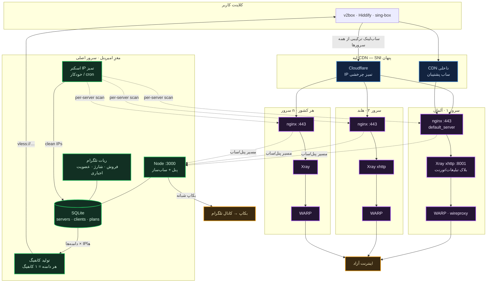
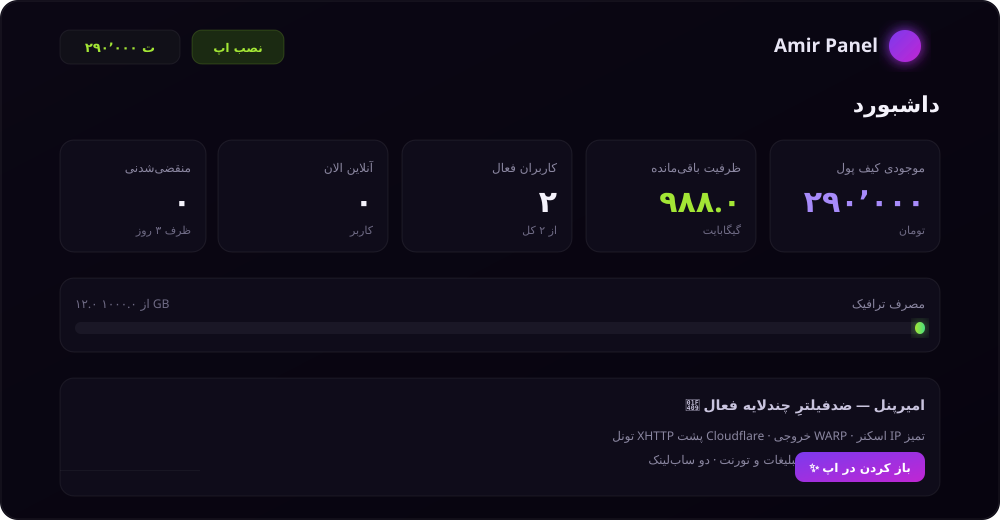

<a id="top"></a>
<div align="center">

# ⚔️ AmirPanel — امیرپنل

### The complete one-command anti-censorship VPN reseller stack
**x-ui · Xray (XHTTP/Reality) · WARP · nginx · Clean-IP scanner · Reseller panel + Telegram bot**

<br>

<!-- ─────────── کانالِ اصلی — چشم‌گیر و بالا ─────────── -->
### 💬 کانال · پشتیبانی · همکاری

<a href="https://t.me/v28pn">

</a>

_بیا کنارِ هم باگ بزنیم، ایده بدیم، و معروفش کنیم_

<br>

<!-- ─────────── دکمهٔ سوییچِ زبان ─────────── -->
[](#fa)
[](#en)

<br>


### 🔴 [دموی زندهٔ برندینگ → Live branding demo](https://amirgraph.github.io/xui-reseller/demo/)

</div>

---

<a id="architecture"></a>

## 🧭 معماری · Architecture

سه لایهٔ مستقلِ ضدفیلتر، چندسروره، با مغزِ مرکزیِ واحد:



**سه لایه، سه نقطهٔ شکستِ مستقل:** SNI پشتِ Cloudflare پنهان است · IP مقصد یک IP تمیزِ کلادفلر است (نه IP سرور) · خروجی از WARP می‌رود تا IP واقعیِ سرور لو نرود. **چندسروره:** ساب‌لینک از همهٔ سرورهای فعال ساخته می‌شود و اسکنرِ هر سرور IPهای تمیزِ خودش را جدا نگه می‌دارد.

**لایهٔ چهارم (اختیاری، سمتِ کلاینت):** توگلِ **⚡ ضدفیلتر** یک دوقلوی fragment/PattNG از هر کانفیگ می‌سازد که در خودِ ساب‌لینک (`fm`+`fp=unsafe`+`cs`) جاسازی می‌شود → روی نت‌های پرمحدودیت هم آپلود و هم فیلترِ دامنه را رد می‌کند. جزئیات پایین‌تر در بخشِ «⚡ کانفیگِ ضدفیلتر».

---

<a id="fa"></a>

## 🇮🇷 فارسی &nbsp;·&nbsp; [پرش به English ↓](#en)

### امیرپنل چیست؟

**امیرپنل** یک اکوسیستمِ آمادهٔ فروشِ VPN است که برای شرایطِ سختِ فیلترینگ ساخته شده. به‌جای ساعت‌ها سرِهم‌کردنِ دستیِ x-ui و WARP و nginx و ربات، **یک دستور می‌زنی، چند سؤال جواب می‌دهی، و کلِ کسب‌وکارت بالا می‌آید** — پنلِ نماینده، رباتِ تلگرام، قیمت‌گذاری، پرداختِ کریپتو، و ضدفیلترِ چندلایه.

<div align="center">

<br><em>داشبوردِ پنلِ نماینده — مدرن، RTL، گلَس‌مورفیسم</em>
</div>

### ✨ ویژگی‌ها

| | |
|---|---|
| 🛡️ **ضدفیلترِ چندلایه** | تونلِ **xhttp** پشتِ **Cloudflare** با ساب‌دامینِ تصادفی · خروجی از **WARP** · **اسکنرِ IP تمیز** خودکار |
| ⚡ **کانفیگِ ضدفیلتر (PattNG)** | با یک توگل، دوقلوی **fragment + fp=unsafe + cipherSuites** روی هر کانفیگ → ردِ **throttle آپلود** و **فیلترِ دامنه** بدونِ تنظیمِ دستی |
| 🌍 **چندکشوره** | چند سرورِ 3x-ui در یک پنل؛ **هر تعداد دامنه → همان‌تعداد کانفیگ و همان‌تعداد IP اسکن** |
| 💼 **آمادهٔ کسب‌وکار** | پنلِ نماینده با برندینگ · رباتِ تلگرام · قیمت‌گذاریِ کامل · کارت‌به‌کارت و **کریپتو (Plisio)** |
| 💾 **بکاپِ خودکار** | هر شب به کانالِ تلگرام + بکاپ/بازیابیِ لحظه‌ای از پنل (WAL-safe) |
| 🎙️ **ویس‌چتِ زنده** | LiveKit روی صفحهٔ ساب (اختیاری) |
| 🔒 **امن از پایه** | **هیچ رمز/کلیدی در ریپو نیست** — همه هنگام نصب پرسیده یا خودکار ساخته می‌شود |

### 🚀 نصب — یک دستور

```bash
git clone https://github.com/amirgraph/xui-reseller.git amirpanel
cd amirpanel
sudo bash setup.sh
```

نصب‌کننده می‌پرسد: دامنه‌ها، توکنِ ربات و ادمین، یوزر/رمزِ x-ui، قیمت‌گذاری، IP سرور. کلیدهای امنیتی (JWT و …) خودکار ساخته می‌شوند.
**پیش‌نیاز:** سرورِ **تازهٔ** اوبونتو ۲۲/۲۴ + یک دامنهٔ اصلی + یک دامنه روی Cloudflare.

### 🔄 به‌روزرسانی

پنل نسخهٔ خود را با ریپو مقایسه می‌کند؛ اگر نسخهٔ جدیدتری باشد، در **داشبوردِ ادمین** بنرِ «آپدیت موجود است» ظاهر می‌شود. برای آپدیت، این دستور را روی سرور بزن (`.env` و دیتابیس دست‌نخورده می‌مانند):

```bash
curl -fsSL https://raw.githubusercontent.com/amirgraph/xui-reseller/main/scripts/update.sh | sudo bash
```

### 🌍 چندکشوره · افزودنِ نود و دامنه

**دو حالتِ نصب** (نصب‌کننده اول می‌پرسد):
- **پنلِ کامل** — پنل + ربات + فروش (سرورِ اصلی).
- **فقط نود** — فقط معماریِ ضدفیلتر (x-ui + xray + WARP + nginx) بدونِ پنل؛ برای **افزودنِ کشورِ جدید به پنلِ اصلی** یا نودِ ضدفیلترِ مستقل.

**افزودنِ یک کشورِ جدید (نود):**
1. روی سرورِ جدید: `sudo bash setup.sh` → گزینهٔ **«فقط نود»**. (x-ui + xray + WARP + nginx بالا می‌آید و یک API token می‌سازی.)
2. DNS ساب‌دامین‌های آن نود را با پروکسیِ Cloudflare به IP نود بزن.
3. در **پنلِ اصلی → سرورها → افزودن**: آدرسِ x-ui نود (`https://<node-subdomain>`)، مسیر، API token، و دامنه‌ها را وارد کن.

**اسکنرِ IP این نود از کجا می‌آید؟** 👈 از **خودِ پنلِ اصلی**: بعد از افزودنِ سرور، در **سرورها → دکمهٔ دانلودِ اسکنر**، اسکریپتِ مخصوصِ همان نود (با `server_id` و `token` و آدرسِ پنل درونش) را بگیر و روی نود (یا هر جا) اجرا/cron کن. خودش IPهای تمیز را پیدا و مستقیم به پنلِ اصلی feed می‌کند (endpoint: `/sub/apply-cleanip`). ویندوز و لینوکس/مک هر دو نسخه دارند.

**افزودنِ دامنه:** فیلدِ `domains` هر سرور کاما-جداست و **هر تعداد** می‌پذیرد → به ازای هر دامنه یک کانفیگ و به همان تعداد IP تمیز. بلاکِ ۴۴۳ روی `default_server` است، پس هر ساب‌دامینِ جدیدی که DNSش را به سرور بزنی بدونِ دستکاریِ nginx کار می‌کند.

### ⚡ کانفیگِ «ضدفیلتر» (فرگمنت / PattNG)

روی نت‌های با **محدودیتِ شدید**، دو مشکل هست که کانفیگِ معمولی حلشان نمی‌کند: **کندیِ آپلود** (throttle) و **فیلترِ دامنه** (DPI روی SNI). راهِ کلاسیک SNI-spoofing است، ولی ترکیبِ **fragment + fingerprint + cipherSuites** همان کار را ساده‌تر می‌کند.

**توگل:** پنلِ ادمین → **سرورها** → «کانفیگِ ⚡ ضدفیلتر (فرگمنت / PattNG) فعال باشد».

**وقتی روشن باشد**، به‌ازای هر کانفیگِ عادی، یک **دوقلوی «⚡ ضدفیلتر»** هم به ساب اضافه می‌شود که این‌ها را درونِ خودش دارد (بدونِ هیچ تنظیمِ دستیِ کاربر):

| پارامتر | مقدار | نقش |
|---|---|---|
| `fp` | `unsafe` | فینگرپرینتِ TLS مخصوصِ PattNG |
| `fm` | *finalMask* — دو مرحله fragment (`tlshello` + `1-1`) | ClientHello/SNI را می‌شکند → DPI نمی‌خواند + آپلود باز می‌شود |
| `cs` | لیستِ کاملِ cipherSuites | دست‌دهیِ TLS طبیعی/ضدِتشخیص |
| `alpn` | `http/1.1` | (کانفیگِ عادی `h2,http/1.1` دارد) |

**معماری:** این تنظیمات **سمتِ کلاینت**اند و مکملِ زیرساختِ سرور (XHTTP + Cloudflare + IP تمیز). مولدِ ساب (`app/src/routes/sub.js`) دوقلوها را روی **همان IP تمیز/دامنه/مسیرِ** کانفیگِ عادی می‌سازد؛ مقادیرِ `fm`/`cs` ثابت و در همان فایل‌اند (منبع: کانالِ [PattNG](https://t.me/patt_channel_x)).

**⚠️ مهم:** کانفیگِ «⚡ ضدفیلتر» **فقط در اپِ [PattNG](https://github.com/patterniha/PattNG)** کار می‌کند (`fp=unsafe` استانداردِ vless نیست). کانفیگ‌های عادی (`fp=chrome`) برای بقیهٔ اپ‌ها (v2rayNG/هیدیفای/…) سرِ جای‌شان می‌مانند. کاربر فقط PattNG را نصب و ساب را رفرش می‌کند — بقیه خودکار است.

### ⚙️ بعد از نصب

1. **Cloudflare** — ساب‌دامین‌های امیرپنل را با پروکسیِ نارنجی به IP سرور بزن.
2. **CDN داخلی (آروان/…)** — دامنهٔ اصلی را وصل و کش را برای `/sub` روشن کن.
3. **ربات** — توکن را از [@BotFather](https://t.me/BotFather) بگیر.

### ❓ رفعِ ابهام (FAQ)

<details>
<summary><b>از قبل x-ui با کاربر دارم؛ نصب کنم چه می‌شود؟</b></summary>

<br>برای **سرورِ تازه** طراحی شده. روی سروری با x-uiِ موجود:
- ✅ **اینباند و کاربرانِ موجود حفظ می‌شوند** (پکیج هیچ DB همراه ندارد + قبل از تغییر **بکاپِ خودکارِ** `x-ui.db`).
- ⚠️ ولی **پورت/مسیر/رمزِ پنل و قالبِ routing بازنویسی می‌شود** و ۴۴۳ را nginx می‌گیرد.

👉 توصیه: روی سرورِ تمیز نصب کن.
</details>

<details>
<summary><b>کانفیگ‌ها پینگ نمی‌دهند</b></summary>

<br>(۱) DNS ساب‌دامین‌ها روی سرور و **پروکسیِ Cloudflare نارنجی**؛ (۲) مسیرِ تونل در کانفیگ = مسیرِ nginx/xray (نصب‌کنندهٔ جدید خودکار هماهنگ می‌کند)؛ (۳) IPهای تمیز پر شده باشند. یک GETِ خالی روی مسیرِ تونل **۴۰۴** می‌دهد و **طبیعی** است.
</details>

<details>
<summary><b>وسطِ چتِ AI یا استریم قطع می‌شود / ناوسان</b></summary>

<br>تقریباً همیشه **auto-switch/url-test در کلاینت** است: با چند کانفیگ در حالتِ خودکار، اپ هر چند ثانیه کانفیگ را عوض می‌کند و اتصالِ استریمِ طولانی قطع می‌شود. **یک کانفیگِ ثابت را Pin کن**؛ بقیه فقط backup.
</details>

### 🩺 عیب‌یابی

```bash
sudo bash scripts/99-verify.sh   # تستِ تونل، WARP، nginx، پنل، ربات
pm2 logs xui-reseller            # لاگِ پنل
```

<div align="right"><a href="#top">↑ بالا</a></div>

---

<a id="en"></a>

## 🇬🇧 English &nbsp;·&nbsp; [پرش به فارسی ↑](#fa)

**AmirPanel** is a batteries-included VPN reseller stack for hostile networks. Instead of wiring up x-ui, WARP, nginx and a Telegram bot by hand, you run **one command, answer a few questions, and your whole business is live** — reseller panel, Telegram bot, pricing, crypto payments, and multi-layer anti-censorship. See the [architecture diagram ↑](#architecture).

### Features

- 🛡️ **Multi-layer evasion** — `xhttp` tunnel behind **Cloudflare** with random subdomains, **WARP** egress (hides origin IP), and an **auto clean-IP scanner**.
- ⚡ **Anti-filter configs (PattNG)** — one toggle adds a **fragment + fp=unsafe + cipherSuites** twin of every config → beats **upload throttling** and **domain filtering** with zero manual setup.
- 🌍 **Multi-server** — attach several 3x-ui panels to one dashboard. **Add any number of domains → that many configs and that many scanned IPs**, automatically.
- 💼 **Business-ready** — branded reseller panel, Telegram bot for sales/top-ups, full pricing, card + **crypto (Plisio)** payments.
- 💾 **Automatic backups** — nightly to a Telegram channel + on-demand backup/restore from the admin panel (WAL-safe).
- 🎙️ **Live voice chat** — optional LiveKit room on the subscription page.
- 🔒 **Secure by design** — **no secrets in the repo**; everything is prompted or auto-generated at install.

### Install

```bash
git clone https://github.com/amirgraph/xui-reseller.git amirpanel
cd amirpanel
sudo bash setup.sh
```

Requires a **fresh** Ubuntu 22/24 server, one main domain, and one Cloudflare domain.

### Multi-server, nodes & adding domains

The installer asks for an **install mode**: **Full panel** (panel + bot + sales) or **Node only** (just the anti-censorship stack — x-ui + xray + WARP + nginx — with no panel), used to **add a new country to your main panel** or run a standalone node.

**Add a new country (node):** run `sudo bash setup.sh` on the new server and pick **Node only**; point its subdomains (Cloudflare-proxied) at it; then in the **main panel → Servers → Add**, enter the node's x-ui URL (`https://<node-subdomain>`), path, API token and domains.

**Where does the node's IP scanner come from?** 👉 from the **main panel** itself: after adding the server, hit **Servers → Download scanner** to get a per-server script (with its `server_id`, `token` and panel URL baked in). Run/cron it on the node — it finds clean IPs and feeds them straight back to the panel (`/sub/apply-cleanip`). Windows and Linux/macOS versions included.

**Adding domains:** a server's comma-separated `domains` accepts **any number** — one config per domain, and the scanner keeps that many clean IPs. nginx is `default_server`, so any new subdomain just works once DNS points at the server.

### ⚡ "Anti-filter" configs (fragment / PattNG)

On **heavily throttled** networks two problems survive a normal config: **upload throttling** and **SNI-based domain filtering**. Instead of SNI-spoofing, a **fragment + fingerprint + cipherSuites** combo does the same job.

**Toggle:** Admin panel → **Servers** → "Enable ⚡ anti-filter (fragment / PattNG) configs".

When on, each normal config gets an **⚡ anti-filter twin** in the subscription carrying — with zero manual setup — `fp=unsafe`, `fm=` (a two-stage *finalMask* fragment that splits the TLS ClientHello so DPI can't read the SNI and upload isn't throttled), and `cs=` (a full cipher-suite list for a natural TLS handshake). These are **client-side** settings that complement the server stack (XHTTP + Cloudflare + clean IP); the sub generator (`app/src/routes/sub.js`) builds the twins on the **same clean IP / domain / path**, with the `fm`/`cs` values fixed in that file (source: the [PattNG](https://t.me/patt_channel_x) channel).

**⚠️ The ⚡ configs work only in the [PattNG](https://github.com/patterniha/PattNG) app** (`fp=unsafe` isn't standard vless); the normal `fp=chrome` configs stay for every other client. Users just install PattNG and refresh the sub — everything else is automatic.

### Tech stack

`Bash` · `Node.js 20` · `Express` · `SQLite` · `nginx` · `Xray-core (XHTTP/Reality)` · `Cloudflare WARP (wireproxy)` · `Telegram Bot API` · `PM2`

<div align="right"><a href="#top">↑ top</a></div>

---

<div align="center">

## ☕ دونیت — Donate

اگر امیرپنل برایت کار راه انداخت، یه قهوه مهمونمون کن 😄 — کریپتو، از هر جای دنیا.

<a href="https://t.me/v28pn">

</a>

<br>

**License:** MIT — آزاد برای استفاده و تغییر. اگر به کارت آمد، یک ⭐ لطف کن.

<sub>Made for a free internet · ساخته‌شده برای اینترنتِ آزاد</sub>

</div>
